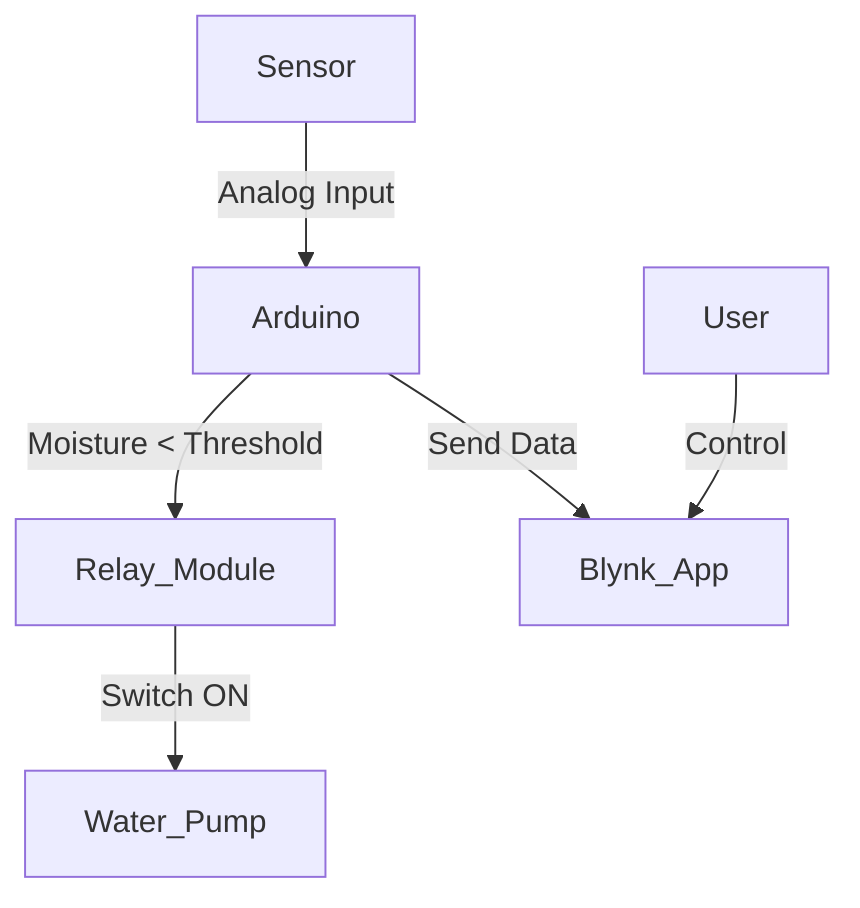

# Smart-Irrigation-System
Designed and implemented an automated irrigation system to optimize water usage in agriculture using IoT and sensor-based automation.

# 💧 Smart IoT-Based Irrigation System

An intelligent, automated irrigation system designed using IoT and sensor technology to optimize water usage in agriculture. This project uses real-time soil moisture data to trigger irrigation through a relay-activated water pump, minimizing manual effort and conserving water.

---

## 📌 Features

- 🌱 Real-time monitoring of soil moisture using analog sensors
- 💧 Automatic water pump control based on moisture threshold
- 📲 Remote access and monitoring via **Blynk IoT Mobile App**
- 🔌 Arduino Uno + Relay module for efficient hardware control
- 🧠 Python and C-based logic to integrate hardware and cloud

---

## 🛠 Technologies & Components

| Category       | Tools & Components                         |
|----------------|--------------------------------------------|
| Microcontroller| Arduino Uno R3                             |
| Sensors        | Soil Moisture Sensor                       |
| Output Device  | DC Water Pump + Relay Module               |
| IoT Platform   | Blynk IoT App                              |
| Programming    | Python, C                                  |
| IDEs           | Arduino IDE, VS Code                       |

---

## ⚙️ System Workflow



---

## 📱 Mobile App Interface

- Live soil moisture readings
- Manual ON/OFF control for water pump
- Notifications for abnormal conditions

> 📲 *Built using Blynk mobile app for Android & iOS*

---

## 📁 Project Structure

```
/Smart-Irrigation/
├── ArduinoCode/           # Sensor and relay logic in C
├── PythonControl/         # Blynk API interactions (if used)
├── media/                 # Screenshots, demo images
└── README.md
```

---

## 🚀 Future Improvements

- Add DHT11 sensor for temperature and humidity integration
- Integrate solar power for energy independence
- Create predictive irrigation using ML models

---

## 👨‍💻 Author

**Sumedh Dhangar**  
[LinkedIn](https://www.linkedin.com/in/sumedh-dhangar) | [GitHub](https://github.com/Sumedh2911)
